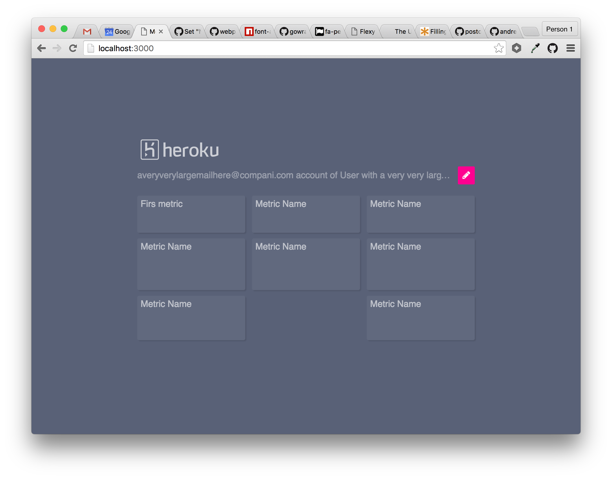

## What is this?
Just me playing with React to develop a small metrics UI component. The objective is be able to make the UI and test the resulting code.



## Installation

```bash
git clone https://github.com/andresgutgon/test-newr.git
cd test-newr
npm install
npm run start
open http://localhost:3000
```

## Deploy

```bash
npm run deploy
```
## Reference
This boilerplate project is based on [Gaearon's Boilerplate](https://github.com/gaearon/react-transform-boilerplate)
